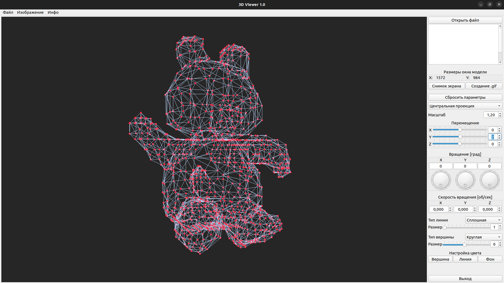

# Информация о различных источниках для проекта 3DViewer_1.0

# Описание проекта

Этот проект является учебным. 
В этом проекте была поставлена задача создать приложение, которое сможет открывать файлы с разрешением <b>*.obj</b>. Данные файлы содержат информацию с координатами точек, которые в последствии позволяют построить линии и грани модели. Полученная модель должна отображаться в области окна, которая использует openGL или другие технологии (Vulkan, ...) для отображения 3D моделей. При этом должна быть обеспечена возможность осуществлять перемещение модели, вращение, изменять стили отображения вершин и граней, цвет фона и изменять тип проекций. Так же должны быть добавлены две функции, которые позволяют делать скриншот и пятисекундную gif-анимацию.
По заданию вращение и перемещение должны были выполняться не средствами pipeline (конвеера) openGL, а собственноручно написанными аффинными преобразованиями.
Программа выполнялась с использованием языков программирования <b>C</b> и <b>C++</b>, фреймворка <b>Qt</b>. Сборка проекта с помощью qmake проверена на ubuntu 22.04 и MacOS.
В итоге к заданию дополнительно было сделано следующее:
- вращение модели с помощью зажатия ЛКМ в области поля отображения модели.



Почти в конце проекта было принято решение отказаться от использования шейдеров. Но заготовки по шейдерам лежат в папке z_ForFuture_ProgOnShaders.


<span style="color:red">Далее текст не редактировался.</span>


## 1. Описание содержания файла .obj

Хорошое описание по содержанию файлов *.obj можно найти на следующих ресурсах: [тут](https://sites.google.com/site/raznyeurokipoinformatiki/home/opengl-s/zagruzka-formata-obj "Загрузка формата .obj"), [тут](https://ru.wikipedia.org/wiki/Obj#:~:text=%D0%A4%D0%BE%D1%80%D0%BC%D0%B0%D1%82%20%D1%84%D0%B0%D0%B9%D0%BB%D0%BE%D0%B2%20OBJ%20%E2%80%94%20%D1%8D%D1%82%D0%BE%20%D0%BF%D1%80%D0%BE%D1%81%D1%82%D0%BE%D0%B9,%D1%82%D0%B0%D0%BA%D0%B6%D0%B5%20%D0%BF%D0%B0%D1%80%D0%B0%D0%BC%D0%B5%D1%82%D1%80%D1%8B%2C%20%D0%BA%D0%BE%D1%82%D0%BE%D1%80%D1%8B%D0%B5%20%D1%81%D0%BE%D0%B7%D0%B4%D0%B0%D1%8E%D1%82%20%D0%BF%D0%BE%D0%BB%D0%B8%D0%B3%D0%BE%D0%BD%D1%8B. "Википедия").

```
# Список вершин, с координатами (x,y,z[,w]), w является не обязательным и по умолчанию 1.0.
v 0.123 0.234 0.345 1.0
v ...
...
# Текстурные координаты (u,v,[w]), w является не обязательным и по умолчанию 0.
# Текстурная координата по y может быть указана как 1 - v, и при этом по x = u
vt 0.500 -1.352 [0.234]
vt ...
...
# Нормали (x,y,z); нормали могут быть не нормированными.
vn 0.707 0.000 0.707
vn ...
...
# Параметры вершин в пространстве (u [,v] [,w]); свободная форма геометрического состояния (см. ниже)
vp 0.310000 3.210000 2.100000
vp ...
...
# Определения поверхности (сторон) (см. ниже)
f 1 2 3
f 3/1 4/2 5/3
f 6/4/1 3/5/3 7/6/5
f 6//1 3//3 7//5
f ...
...
# Группа
g Group1
...
# Объект
o Object1 
```
#### Координаты вершин (v - vertex)

> v 23.2 -56.4 48.103 <b>1.0</b> <span style="color:red">0.2</span> <span style="color:green">0.7</span> <span style="color:blue">0.4</span>

Вершина задаётся в строках начинающихся с литеры v. Далее за ней располагаются координаты в порядке x,y,z, и необязательный компонент w. Значение w отвечает за толщину вершины и требуется для рациональных кривых и поверхностей, задавать не обязательно, по умолчанию равно 1.0. Некоторые программы поддерживают указание цвета вершин согласно модели RGB, путём задания значений красного, зелёного и синего в диапозоне от 0 до 1 после координат.

#### Координаты нормалей (vn - vertex)

Тут надо дополнять текст.

#### Координаты текстур (vt - vertex)

Тут надо дополнять текст.

#### Поверхности (f - face)

Поверхности могут состоять как из треугольников (3 вершины), так и из квадратов (4 вершины).

> f 6/4/1 3/5/3 7/6/5

<b>Вершина / Координаты текстуры / Координаты нормали</b>

Индекс при построении поверхности может быть и отрицательным, это значит что индекс указывает на элемент начиная с последнего.

## 2. Ссылки на различные источники для проекта 3D Viewer

### 2.1 [Введение в GLSL](https://gamedev.ru/code/articles/GLSL "Введение в GLSL")

### 2.2 [GLSL шейдеры](https://developer.mozilla.org/ru/docs/Games/Techniques/3D_on_the_web/GLSL_Shaders "developer.mozilla.org")

### 2.3 [GLSL в WebGL](https://webglfundamentals.org/webgl/lessons/ru/webgl-shaders-and-glsl.html). Доп. ссылка [начало WebGL](https://webglfundamentals.org/webgl/lessons/ru/webgl-fundamentals.html)

### 2.4 [GLSL wiki](https://ru.bmstu.wiki/GLSL_(OpenGL_Shading_Language))

### 2.5 [GLFW wiki](https://ru.wikipedia.org/wiki/GLFW)
#### 2.5.1 [Как включить GLAD](https://rpxomi.github.io/)
#### 2.5.2 [Генерация файла glad.h](https://glad.dav1d.de/)

### 2.6 [freeglut wiki](https://ru.wikipedia.org/wiki/Freeglut)

### 2.7 [SDL wiki](https://ru.wikipedia.org/wiki/Simple_DirectMedia_Layer)

### 2.8 [SFML wiki](https://ru.wikipedia.org/wiki/SFML). [Оф. сайт](https://www.sfml-dev.org/)

### 2.9 [История и сравнение OpenGL](https://club.dns-shop.ru/blog/t-99-videokartyi/76298-razbor-api-opengl-osobennosti-i-realizatsiya/?utm_referrer=https%3A%2F%2Fwww.google.com%2F "Версии OpenGL")

### 2.10 [Основы VBO в OpenGL](http://vbomesh.blogspot.com/2012/02/vbo-opengl.html "Про VBO и VAO")

### 2.11 [Про glVertexAttribPointer](https://stackoverflow.com/questions/8704801/glvertexattribpointer-clarification "StackOverFlow")

### 2.12 [Разница между glVertexPointer и glVertexAttribPointer](https://community.khronos.org/t/vertexarray-and-vertexattribarray-whats-different/73222 "StackOverFlow")


## 3. Шейдеры (shaders)
### 3.1 Книга по шейерам
[Книга по шейдерам](https://thebookofshaders.com/?lan=ru "The Book of Shaders").
### 3.2 Примеры по шейдерам
Сложные рукописные шейдеры. [Сайт с написанными шейдерами](https://www.shadertoy.com/playlist/week "ShaderToy").


## 4. OpenGL
### 4.1 Изучение OpenGL
[1-ый ресурс для изучения openGL](https://learnopengl.com/Introduction "Lern OpenGL. Изучение OpenGL 3.3 на английском").


### 4.2 Библиотека по классу QOpenGLWidget
[Информация о библиотеке QOpenGLWidget](https://doc.qt.io/qt-6/qopenglwidget.html#details "Документация с сайта qt").
Информация о применении библиотеки, которая подключает OpenGL Widget из QT и использует openGL.

### 4.3 Раборта с qmake
Как настроить в файле *.pro условия выбора в зависимости от системы [тут](http://doc.crossplatform.ru/qt/4.5.0/qmake-advanced-usage.html "Продвинутое использование qmake").

### 4.4 Видео

##### 4.4.1 Qt+OpenGL. Основы, Вращение куба. Игра в 3D: Часть 1. [Ссылка](https://www.youtube.com/watch?v=5tffwWX4a54)

##### 4.4.2 Спиисок уроков по основам QT. [Ссылка](https://www.youtube.com/watch?v=beUbx2R39fU&list=PL0-ON4z3RPUMrT8Qv5I7NZixRk_zuqilt&index=1)

##### 4.4.3 Создание сферы. [Ссылка](https://www.youtube.com/watch?v=A-PRoXR_62Q&t=2s)

##### 4.4.4 Уроки по C++ Qt. [Ссылка](https://www.youtube.com/watch?v=BfVSHnRP_Ew&list=PLdhEOd5Bckb68z9la6gCLgUWQo50Jt_NM)

##### 4.4.5 Уроки по CMake. [Ссылка](https://www.youtube.com/watch?v=4-viiFusYso)

##### 4.4.6 Изменить стили слайдера. [Ссылка](https://www.youtube.com/watch?v=26oC6pU5VUA&list=PLh0cogPqXcJMuRUNMgGZwl5WEX6ZDGqaU)

## 5 Общая информация
### 5.1 Книга столярова "Программирование введение в профессию. 
Читать 3 том 10 раздел. [Ссылка](http://www.stolyarov.info/books/programming_intro/dmk "Столяров, книги")

## 6 Хорошие ссылки

```

Руководство пользователя ImageMagick v. 7.1.0 [Иван Георгиевич Титаренко] - книга по работе с цветами

https://ru.stackoverflow.com/questions/888550/%D0%9F%D1%80%D0%BE%D0%B1%D1%83%D1%8E-%D1%81%D0%BE%D0%B7%D0%B4%D0%B0%D1%82%D1%8C-%D0%BF%D1%80%D0%BE%D0%B3%D1%80%D0%B0%D0%BC%D0%BC%D1%83-%D1%81-%D0%B8%D1%81%D0%BF%D0%BE%D0%BB%D1%8C%D0%B7%D0%BE%D0%B2%D0%B0%D0%BD%D0%B8%D0%B5%D0%BC-opengl-%D0%B1%D0%B8%D0%B1%D0%BB%D0%B8%D0%BE%D1%82%D0%B5%D0%BA%D0%B8-%D0%B2-qt-creator-e - настройка GLFW

https://www.youtube.com/watch?v=rZcTaRU7AAw&list=PLQOaTSbfxUtCrKs0nicOg2npJQYSPGO9r&index=85 - уроки по C++

https://doc.qt.io/qt-6/qtopengl-module.html // виджет qtOpenGLWidget
https://doc.qt.io/qt-6/examples-widgets-opengl.html - OpenGL Examples from the Qt OpenGL module
https://doc.qt.io/qt-6/qopenglwidget.html - QOpenGLWidget Class
https://doc.qt.io/qt-6/qopenglwidget.html
https://habr.com/ru/post/310790/ - learnopengl. Урок 1.1 — OpenGL
https://www.youtube.com/watch?v=McHessF1Q_8 - OpenGL - Урок 17 - Основы текстурирования. Загрузка текстур из файла.

https://www.youtube.com/watch?v=yJE34EuZNzs - хорошая лекция по openGL
https://www.youtube.com/watch?v=9al64H0BPmM - как делать шейдеры

https://startandroid.ru/ru/uroki/vse-uroki-spiskom/399-urok-170-opengl-graficheskie-primitivy.html


```


Про виды перспектив. [Ссылка_1](https://moluch.ru/conf/tech/archive/123/6212/ "Про проекции"). [Ссылка_2](http://www.songho.ca/opengl/gl_projectionmatrix.html "и снова про проекции")


Создание снимка экрана. [Ссылка](https://itnotesblog.ru/note/qmovie-gif-animaciya-v-qt "Создание screenShot'а")


Как сделать gif. [Ссылка](https://itnotesblog.ru/note/qmovie-gif-animaciya-v-qt "На странице есть ссылка на библиотеку")

Как сделать gif-animation (со ссылкой на библиотеку). [Ссылка](https://itnan.ru/post.php?c=1&p=443442 "На странице есть ссылка на библиотеку")

Библиотека для создания GIF'ок. [Ссылка](https://github.com/dbzhang800/QtGifImage/blob/master/README.md "Ссылка на git")